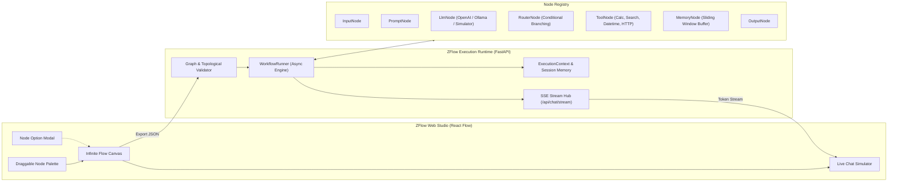

# ⚡ ZFlow — Sovereign Node-Based AI Workflow & Agent Studio

[](https://github.com/kzxl/ZeroUniverse)
[](https://fastapi.tiangolo.com/)
[](https://reactflow.dev/)
[-brightgreen?style=flat-square)]()
[](LICENSE)

**ZFlow** is an enterprise-grade, visual node-based workflow orchestration and multi-agent execution studio engineered specifically for LLM chatbots, conversational pipelines, and autonomous reasoning loops.

Unlike image-generation engines such as ComfyUI (which operate on GPU-bound batch DAGs), ZFlow is architected from the ground up for:
1. **Low-Latency Token Streaming (SSE)**: Sub-50ms Time-to-First-Token (TTFT) streamed directly to client chat interfaces.
2. **Dynamic Cyclic & Multi-turn Execution**: Native support for agentic feedback loops, tool calling reflection, and sliding-window dialogue memory.
3. **Pluggable Node Ecosystem**: Declarative configuration schemas with typed input/output ports for instant parameter binding.

---

## 🏛️ System Architecture



---

## 📦 Project Structure

```
ZFlow/
├── .project-rule.md              # Project directives & architectural constraints
├── README.md                     # Engineering documentation
├── run.bat                       # 1-Click launcher for Windows
├── server/                       # FastAPI Execution Runtime
│   ├── main.py                   # REST & SSE streaming endpoints
│   ├── engine/                   # Graph execution core
│   │   ├── context.py            # ExecutionContext & state tracking
│   │   ├── graph.py              # WorkflowGraph, NodeDef, EdgeDef
│   │   └── runner.py             # Asynchronous streaming runner
│   ├── nodes/                    # Node implementation registry
│   │   ├── base.py               # BaseNode & NodeRegistry contracts
│   │   ├── input_node.py         # User input entry node
│   │   ├── prompt_node.py        # Template interpolation node
│   │   ├── llm_node.py           # LLM inference & streaming engine
│   │   ├── router_node.py        # Conditional branch evaluator
│   │   ├── tool_node.py          # Functional tool invoker
│   │   ├── memory_node.py        # Conversation buffer manager
│   │   └── output_node.py        # Chat response terminal node
│   ├── storage/                  # Flow definitions & default templates
│   │   └── default_flow.json     # Standard Starter Chatbot Flow
│   └── requirements.txt
├── web/                          # React Flow Modern UI Studio
│   ├── package.json
│   ├── vite.config.ts
│   ├── src/
│   │   ├── App.tsx               # Main Studio canvas layout
│   │   ├── components/           # Header, Sidebar, ChatDrawer, NodeModal
│   │   ├── types/workflow.ts     # TypeScript definitions
│   │   └── api/client.ts         # REST & SSE stream client
└── tests/
    └── test_engine.py            # Automated backend engine test suite
```

---

## 🚀 Quick Start Guide

### 1. Launch with 1-Click Launcher (Windows)
Double-click `run.bat` or run:
```cmd
run.bat
```

### 2. Manual Startup

#### Step 1: Start the Backend Server
```bash
cd server
python -m uvicorn main:app --host 127.0.0.1 --port 8000 --reload
```
API Documentation will be available at: `http://127.0.0.1:8000/docs`.

#### Step 2: Start the Web UI
```bash
cd web
npm install
npm run dev
```
Open `http://localhost:5173` in your browser.

---

## 🧪 Running Automated Tests
```bash
python tests/test_engine.py
```
Outputs:
```text
Verified 7 registered nodes.
Batch execution result: Chào bạn! Tôi đang xử lý yêu cầu qua ZFlow Engine...
Streaming test passed with 104 tokens generated.
All ZFlow Engine tests passed successfully!
```
